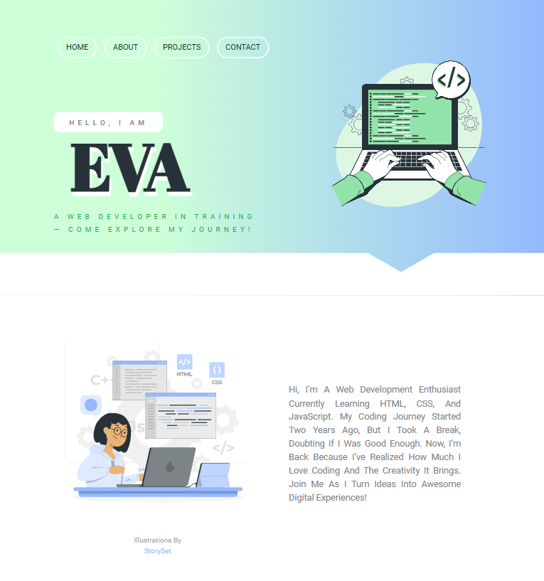

<h1 align="center"> Simple portfolio</h1>

  <h3>
    <a href="https://codebyev.github.io/portfolio/">
      Demo
    </a>
  </h3>

My simple portfolio page created with HTML and CSS.

Illustrations by  <a href="https://storyset.com/"> Storyset </a>
Shape divider by  <a href="https://www.shapedivider.app/"> Shapedivider.app </a>
